# NYU_DL_Sys_Project
Xiang Pan, Joon Kim
<!-- A description of the project
A description of the repository and code structure
Example commands to execute the code         
Results (including charts/tables) and your observations   -->

# Description
Labeling is expensive and highly human-relied. For general domain text classification tasks, e.g., sentiment analysis or topic classification, BERT embedding is self-clustered and does not need many annotations to get high accuracy. But for a new domain (e.g., COVID-19), the Pretrained Language Models’ embedding may not satisfy the good self-clustered property. This project tend to explore the **tranfer learning and active learning** in the less pretrained domain.


# Repo
## Dataset
[CovidQCLS](https://huggingface.co/datasets/XiangPan/CovidQCLS)


## Model
All the model can be found in the huggingface repo.

## Code Structure
```
.
├── cached_datasets 
├── cached_models
├── ckpt_path.txt
├── figures         
├── LICENSE
├── lightning_logs 
├── name2id.json       # wandb unique id log
├── notebooks
├── options.py
├── outputs
├── project.csv
├── README.md
├── RESULTS.md
├── scripts            # all the scripts
├── task_datasets      # self-defined datasets based on pytorch datasets
├── task_models        # pytorch-lightning models
├── tasks              # differnt task types
├── tools
├── viz                # visualization related files
└── wandb              # wandb local log results
```

# How to Run
You can check the scripts folder to find the bash scripts. All the scripts and code should be run in the project folder.
```
# for scritps
./scripts/run_al_base.sh
# for python
python ./tasks/*.py --arges
```

```
./scripts/run_al_base.sh            # baseline model active learning
./scripts/run_al_domain.sh          # same domain transferred model
./scripts/run_al_task.sh            # same task transferred model
./scripts/run_al_task_and_domain.sh # task&domain transferred model
```

## For Single Result
```
python tasks/run_active_learning_training.py --method <AL_Method> --max_epochs 100 --lr 1e-5 --batch_size 32 --gpus 0, 

# e.g.
python tasks/run_active_learning_training.py --method random --max_epochs 100 --lr 1e-5 --batch_size 32 --gpus 0, 
```

# Enviroment
Please check 310.yml for the enviroment setting.

# Results
## Performance Metrics
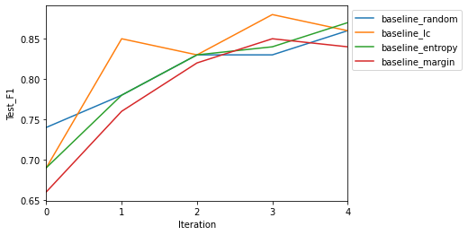


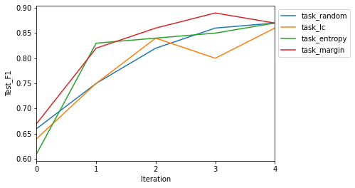

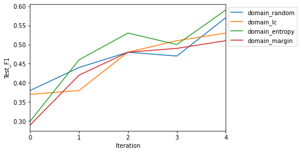

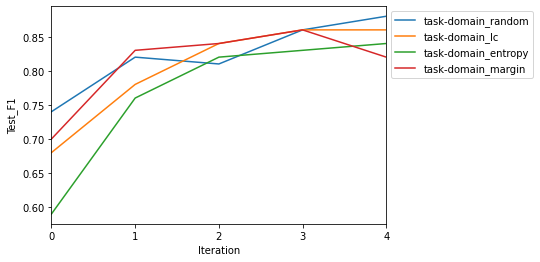

## Efficiency Metrics
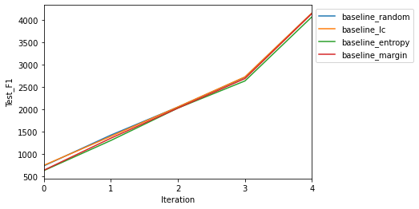


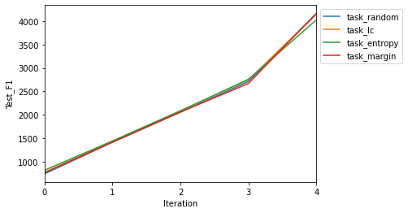

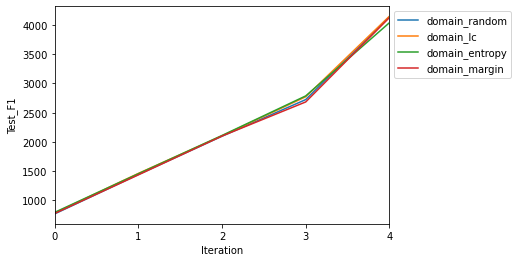

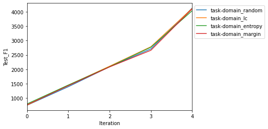

## Distance Metrics
<!-- |-------------|-----|-----|-----|---|-----|----| -->
| log_name              | max_l2_dist | min_l2_dist | mean_l2_dist | max_cos_dist | min_cos_dist | mean_cos_dist |
| --------------------- | ----------- | ----------- | ------------ | ------------ | ------------ | ------------- |
| baseline_entropy_0    | 12.78       | 4.65        | 8.84         | 1            | -0.27        | 0.13          |
| baseline_entropy_1    | 14.79       | 5.84        | 11.11        | 1            | -0.26        | 0.04          |
| baseline_entropy_2    | 14.86       | 8.68        | 11.9         | 1            | -0.2         | 0.02          |
| baseline_entropy_3    | 14.66       | 10.86       | 12.2         | 1            | -0.2         | 0.02          |
| baseline_entropy_4    | 15.59       | 10.78       | 12.47        | 1            | -0.21        | 0.02          |
| baseline_lc_0         | 13.58       | 4.15        | 9            | 1            | -0.3         | 0.12          |
| baseline_lc_1         | 14.8        | 7.85        | 11.33        | 1            | -0.3         | 0.03          |
| baseline_lc_2         | 14.57       | 7.55        | 11.07        | 1            | -0.25        | 0.07          |
| baseline_lc_3         | 14.89       | 10.78       | 12.23        | 1            | -0.2         | 0.03          |
| baseline_lc_4         | 15.05       | 11.3        | 12.43        | 1            | -0.18        | 0.02          |
| baseline_margin_0     | 13.67       | 4.42        | 8.86         | 1            | -0.24        | 0.17          |
| baseline_margin_1     | 14.54       | 5.97        | 10.19        | 1            | -0.26        | 0.13          |
| baseline_margin_2     | 14.35       | 8.1         | 11.02        | 1            | -0.2         | 0.08          |
| baseline_margin_3     | 14.7        | 10.4        | 12.09        | 1            | -0.24        | 0.03          |
| baseline_margin_4     | 15.46       | 11.26       | 12.64        | 1            | -0.18        | 0.02          |
| baseline_random_0     | 14.14       | 5.09        | 9.38         | 1            | -0.37        | 0.13          |
| baseline_random_1     | 14.1        | 7.56        | 10.75        | 1            | -0.3         | 0.06          |
| baseline_random_2     | 14.6        | 10.07       | 11.77        | 1            | -0.24        | 0.03          |
| baseline_random_3     | 14.89       | 10.55       | 12.43        | 1            | -0.19        | 0.02          |
| baseline_random_4     | 14.59       | 9.76        | 11.96        | 1            | -0.27        | 0.05          |
| domain_entropy_0      | 5.38        | 1.32        | 2.76         | 1            | -0.03        | 0.5           |
| domain_entropy_1      | 5.94        | 2.27        | 3.69         | 1            | -0.1         | 0.27          |
| domain_entropy_2      | 5.76        | 2.96        | 4.11         | 1            | -0.32        | 0.19          |
| domain_entropy_3      | 6.87        | 3.7         | 4.72         | 1            | -0.25        | 0.14          |
| domain_entropy_4      | 6.51        | 4.03        | 5            | 1            | -0.27        | 0.15          |
| domain_lc_0           | 4.11        | 1.22        | 2.41         | 1            | -0.03        | 0.46          |
| domain_lc_1           | 5.39        | 2.45        | 3.67         | 1            | -0.11        | 0.26          |
| domain_lc_2           | 5.42        | 1.92        | 3.84         | 1            | -0.22        | 0.24          |
| domain_lc_3           | 6.48        | 3.8         | 4.69         | 1            | -0.2         | 0.18          |
| domain_lc_4           | 6.58        | 3.93        | 4.97         | 1            | -0.3         | 0.13          |
| domain_margin_0       | 4.07        | 1.66        | 2.52         | 1            | 0.12         | 0.56          |
| domain_margin_1       | 5.22        | 3.03        | 3.79         | 1            | -0.19        | 0.22          |
| domain_margin_2       | 5.94        | 3.45        | 4.49         | 1            | -0.25        | 0.15          |
| domain_margin_3       | 6.14        | 4.25        | 4.76         | 1            | -0.19        | 0.16          |
| domain_margin_4       | 6.67        | 4.34        | 5.08         | 1            | -0.2         | 0.12          |
| domain_random_0       | 4.57        | 1.59        | 2.74         | 1            | -0.1         | 0.43          |
| domain_random_1       | 5.69        | 2.53        | 3.82         | 1            | -0.12        | 0.23          |
| domain_random_2       | 5.69        | 3.3         | 4.41         | 1            | -0.18        | 0.16          |
| domain_random_3       | 5.81        | 3.64        | 4.54         | 1            | -0.18        | 0.15          |
| domain_random_4       | 6.39        | 4.41        | 4.91         | 1            | -0.2         | 0.13          |
| task_entropy_0        | 13.21       | 5.49        | 9.24         | 1            | -0.28        | 0.09          |
| task_entropy_1        | 14.29       | 5.48        | 10.4         | 1            | -0.3         | 0.1           |
| task_entropy_2        | 15.03       | 9.77        | 11.9         | 1            | -0.23        | 0.03          |
| task_entropy_3        | 15.41       | 11.69       | 12.46        | 1            | -0.17        | 0.02          |
| task_entropy_4        | 15.05       | 10.41       | 12.42        | 1            | -0.2         | 0.04          |
| task_lc_0             | 12.74       | 4.95        | 8.36         | 1            | -0.39        | 0.14          |
| task_lc_1             | 14.02       | 7.66        | 10.53        | 1            | -0.3         | 0.05          |
| task_lc_2             | 14.98       | 10.86       | 12.26        | 1            | -0.2         | 0.01          |
| task_lc_3             | 15          | 10.44       | 11.96        | 1            | -0.31        | 0.03          |
| task_lc_4             | 14.87       | 10.56       | 12.2         | 1            | -0.22        | 0.02          |
| task_margin_0         | 13.48       | 5.68        | 9.7          | 1            | -0.34        | 0.08          |
| task_margin_1         | 15.04       | 8.92        | 11.35        | 1            | -0.25        | 0.03          |
| task_margin_2         | 15.26       | 7.51        | 11.47        | 1            | -0.31        | 0.05          |
| task_margin_3         | 14.91       | 11.39       | 12.58        | 1            | -0.19        | 0.01          |
| task_margin_4         | 14.95       | 11.64       | 12.64        | 1            | -0.19        | 0.01          |
| task_random_0         | 13.17       | 5.12        | 8.85         | 1            | -0.39        | 0.15          |
| task_random_1         | 14.34       | 6.8         | 10.45        | 1            | -0.35        | 0.08          |
| task_random_2         | 14.39       | 7.51        | 11.06        | 1            | -0.28        | 0.07          |
| task_random_3         | 14.8        | 10.99       | 12.43        | 1            | -0.2         | 0.02          |
| task_random_4         | 15.26       | 11.62       | 12.67        | 1            | -0.19        | 0.01          |
| task-domain_0         | 13.36       | 5.37        | 9.48         | 1            | -0.33        | 0.06          |
| task-domain_1         | 13.76       | 6.57        | 10.47        | 1            | -0.36        | 0.06          |
| task-domain_2         | 14.69       | 9.19        | 11.74        | 1            | -0.25        | 0.02          |
| task-domain_3         | 14.84       | 9.89        | 11.83        | 1            | -0.2         | 0.02          |
| task-domain_4         | 14.45       | 8.74        | 11.77        | 1            | -0.3         | 0.04          |
| task-domain_entropy_0 | 13.34       | 3.31        | 8.72         | 1            | -0.32        | 0.14          |
| task-domain_entropy_1 | 14.73       | 6.96        | 10.71        | 1            | -0.32        | 0.06          |
| task-domain_entropy_2 | 14.85       | 9.72        | 12.07        | 1            | -0.18        | 0.02          |
| task-domain_entropy_3 | 15.28       | 10.61       | 12.09        | 1            | -0.31        | 0.03          |
| task-domain_entropy_4 | 14.97       | 10.07       | 12.35        | 1            | -0.25        | 0.02          |
| task-domain_lc_0      | 12.7        | 4.08        | 8.87         | 1            | -0.3         | 0.14          |
| task-domain_lc_1      | 13.83       | 4.93        | 10.07        | 1            | -0.26        | 0.08          |
| task-domain_lc_2      | 14.82       | 8.79        | 11.72        | 1            | -0.28        | 0.03          |
| task-domain_lc_3      | 14.81       | 10.18       | 12.25        | 1            | -0.25        | 0.03          |
| task-domain_lc_4      | 14.45       | 8.74        | 11.77        | 1            | -0.3         | 0.04          |
| task-domain_margin_0  | 13.36       | 5.37        | 9.48         | 1            | -0.33        | 0.06          |
| task-domain_margin_1  | 13.76       | 6.57        | 10.47        | 1            | -0.36        | 0.06          |
| task-domain_margin_2  | 14.69       | 9.19        | 11.74        | 1            | -0.25        | 0.02          |
| task-domain_margin_3  | 14.84       | 9.89        | 11.83        | 1            | -0.2         | 0.02          |
| task-domain_margin_4  | 15.25       | 10.4        | 12.15        | 1            | -0.25        | 0.02          |
| task-domain_random_0  | 14.28       | 4.55        | 9.43         | 1            | -0.33        | 0.12          |
| task-domain_random_1  | 14.17       | 4.55        | 9.65         | 1            | -0.33        | 0.21          |
| task-domain_random_2  | 14.83       | 9.97        | 11.8         | 1            | -0.25        | 0.02          |
| task-domain_random_3  | 14.95       | 10.11       | 12.15        | 1            | -0.21        | 0.02          |
| task-domain_random_4  | 14.93       | 8.58        | 12.09        | 1            | -0.27        | 0.03          |


# Representation Visualization

For more results, please check the viz folder.

## TSNE_Baseline_Least_Confidence 

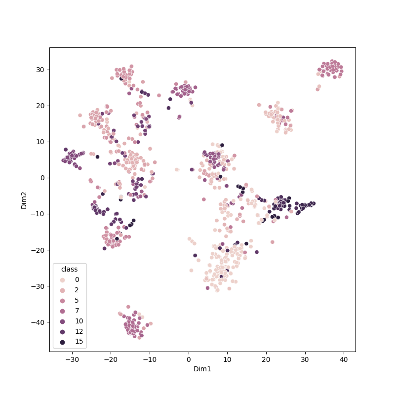

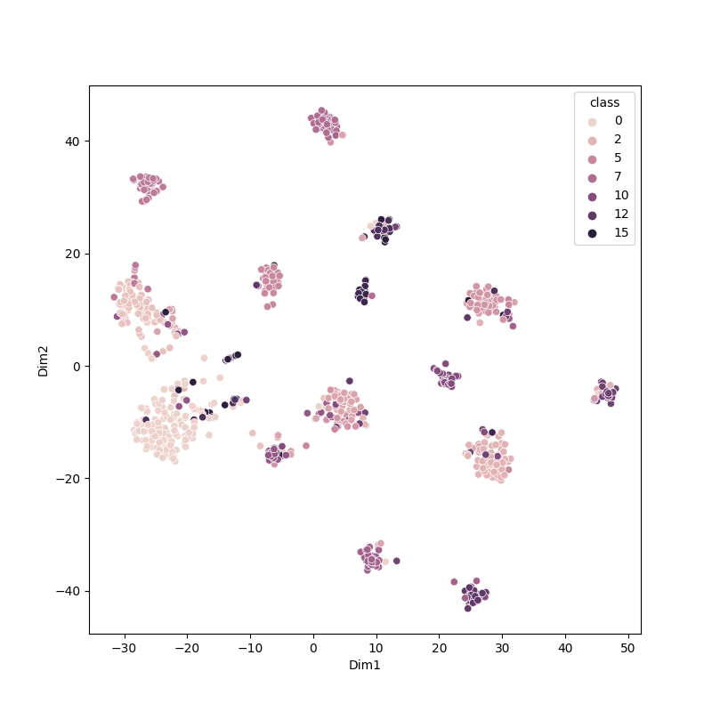

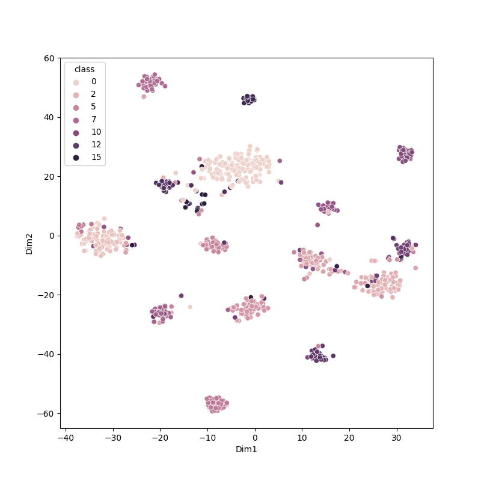

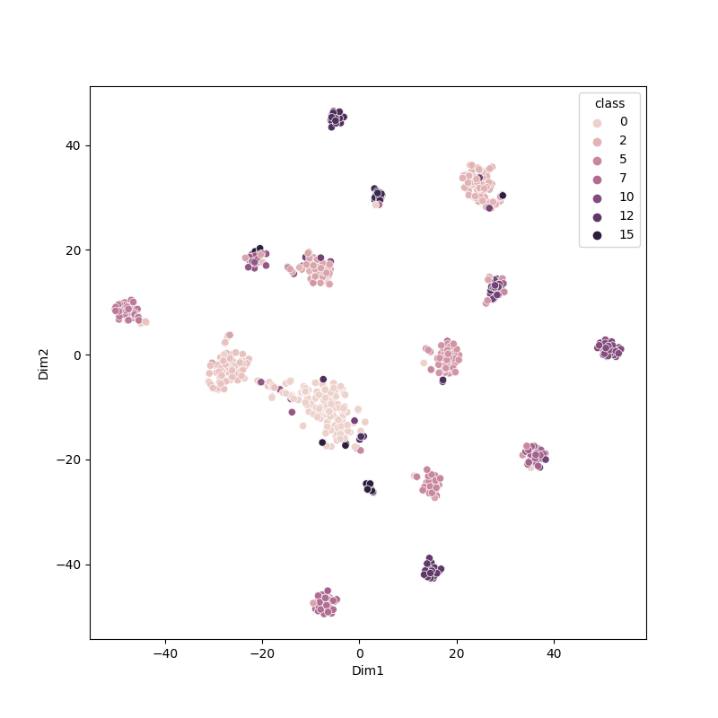

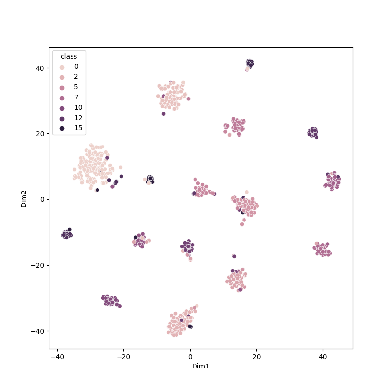


## FewShot (Randomly Conditioned Sampling)

The difference between fewshot and active learning setting is the fewshot sample is conditioned on class, but active learning does not have this constraint.

We use the fewshot setting to explore the conditioned sampling potential, but the results are not comparable to the active learning setting.


